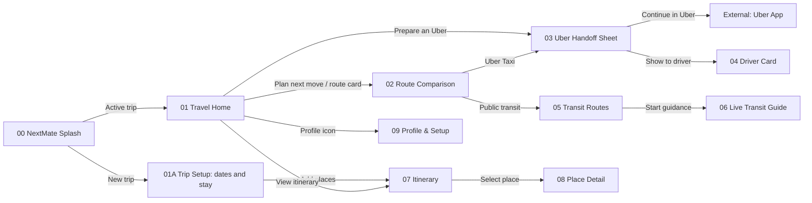

# Travel Home screen flow

The labels on each arrow are the button or tappable UI that triggers the
transition.

## Navigation rules

| Source | Button | Destination | Type |
|---|---|---|---|
| NextMate Splash | Active trip detected | Travel Home | Automatic |
| NextMate Splash | New trip | Trip Setup | Internal |
| Trip Setup | Next · Add places | Itinerary | Internal |
| Travel Home | Plan next move / route card | Route Comparison | Internal |
| Travel Home | Prepare an Uber | Uber Handoff Sheet | Bottom sheet |
| Travel Home | View itinerary | Itinerary | Internal |
| Travel Home | Profile icon | Profile & Setup | Internal |
| Route Comparison | Uber Taxi | Uber Handoff Sheet | Bottom sheet |
| Route Comparison | Public transit | Transit Routes | Internal |
| Uber Handoff Sheet | Continue in Uber | Uber App | External deep link |
| Uber Handoff Sheet | Driver card | Driver Card | Internal |
| Transit Routes | Start guidance | Live Transit Guide | Internal |
| Itinerary | Select place | Place Detail | Internal |
